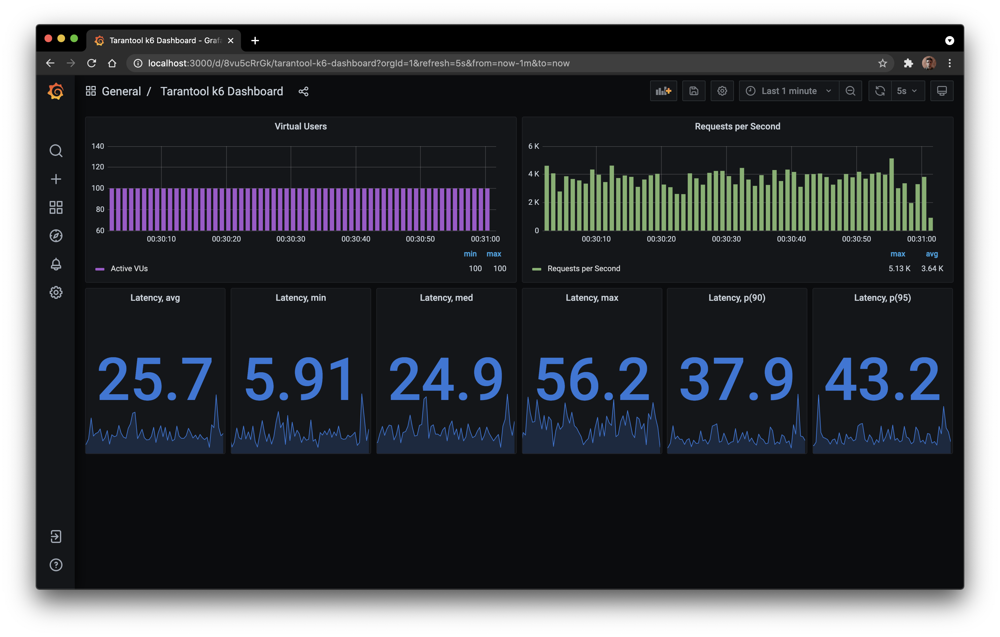

# xk6-tarantool-example

Пример использования модуля [xk6-tarantool](https://github.com/hackfeed/xk6-tarantool) для системы 
нагрузочного тестирования [k6](https://k6.io).

## Сборка

### Требования

Для того, чтобы использовать данный пример, убедитесь, что у вас установлены:

* [Ansible](https://ansible.com)
* [ansible-cartridge](https://github.com/tarantool/ansible-cartridge)
* [Vagrant](https://vagrantup.com)
* [Docker](https://docker.com)
* [Cartridge CLI](https://github.com/tarantool/cartridge-cli)
* [Golang](https://golang.org)
* [Git](https://git-scm.com)

### Развертка окружения

1. Соберите приложение **Tarantool Cartridge**:

```bash
cd cars
cartridge pack --use-docker rpm --version 1.0.0
```

2. В файле `/ansible/hosts.yml` укажите путь до полученного пакета в переменной `cartridge_package_path`.

3. Поднимите виртуальное окружение и дождитесь настройки виртуальных машин:

```bash
vagrant up
```

4. Разверните кластер **Tarantool Cartridge**:

```bash
ansible-playbook -i ansible/hosts.yml ansible/playbook.yml
```

После завершения развертки кластер настроен и готов к работе. Перейдите по адресу [http://localhost:8181](http://localhost:8181) 
и убедитесь, что Ваш кластер настроен так, как на изображении:


5. Разверните средства мониторинга **Grafana + InfluxDB**:

```bash
docker-compose up -d
```

Перейдите по адресу [http://localhost:3000](http://localhost:3000) 
и убедитесь, что Ваш дашборд настроен так, как на изображении:


6. Склонируйте репозиторий `xk6` для сборки `k6` с расширениями:

```bash
git clone https://github.com/k6io/xk6.git
cd xk6
```

7. Соберите исполняемый файл:

```bash
CGO_ENABLED=1 go run ./cmd/xk6/main.go build master \
    --with github.com/hackfeed/xk6-tarantool \
    --with github.com/hackfeed/xk6-tarantool-example/modules/xk6-datagen=$(pwd)/../xk6-tarantool-example/modules/xk6-datagen
```

8. При необходимости, внесите коррективы в сценарий тестирования `/scenarios/test.js`. Подробнее о написании сценариев смотрите в [документации](https://k6.io/docs/using-k6/)

9. Запустите тестирование:

```bash
./k6 run --out influxdb=http://localhost:8086/k6  ../xk6-tarantool-example/scenarios/test.js

          /\      |‾‾| /‾‾/   /‾‾/   
     /\  /  \     |  |/  /   /  /    
    /  \/    \    |     (   /   ‾‾\  
   /          \   |  |\  \ |  (‾)  | 
  / __________ \  |__| \__\ \_____/ .io

  execution: local
     script: ../xk6-tarantool-example/scenarios/test.js
     output: InfluxDBv1 (http://localhost:8086)

  scenarios: (100.00%) 1 scenario, 100 max VUs, 5m30s max duration (incl. graceful stop):
           * constant_request_rate: 10000.00 iterations/s for 5m0s (maxVUs: 100, gracefulStop: 30s)

INFO[0000] Run data generation in the background         source=console
WARN[0000] Insufficient VUs, reached 100 active VUs and cannot initialize more  executor=constant-arrival-rate scenario=constant_request_rate
INFO[0300] Testing complete                              source=console

running (5m00.0s), 000/100 VUs, 1186387 complete and 0 interrupted iterations
constant_request_rate ✓ [======================================] 100/100 VUs  5m0s  10000 iters/s

     █ setup

     █ teardown

     data_received........: 0 B     0 B/s
     data_sent............: 0 B     0 B/s
     dropped_iterations...: 1813613 6044.615005/s
     iteration_duration...: avg=24.62ms min=85.26µs med=21.05ms max=261.08ms p(90)=38.32ms p(95)=48.29ms
     iterations...........: 1186387 3954.125087/s
     vus..................: 100     min=100 max=100
     vus_max..............: 100     min=100 max=100

```

